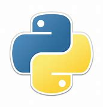

# This is just a read me file for  my Python tutorials
## This is for heading 2
### This is for heading 3
#### This is for heading 4
##### This is for heading 5
###### This is for heading 6

# Styling Texts
*this is italic* or _this is also italic_

**This is bold** or __this is also bold__

# Making Lists
* Item 1
* Item 2
* Item 3
  * Sub-Item 4
  * Sub-Item 5
1. Number 1
2. Number 2

# Inserting Images

 

# Inserting Links and Webpages 
[Clich here](https://www.google.com/) to access google webpage

# Blockquotes 
Step by Step Process to Learn:
> Step 1: Read your books

> Step 2 : Read your books again

> Step 3 : Bla bla

# Code Blocks
We use back ticks 3 above and 3 below
```python
x = [1, 2, 3, 4]
for i in x:
print(i + 1)
```

# Completed Tasks
- [x] This is a completed task
- [ ] This is an incomplete task

# Creating Tables
This is just a simple table showing all employed personnel.

Name | Age | Programming language
-----|-----|---------------------
Nelson | 26 | Python and R
Jane | 30 | Javascript
John | 22 | Julia
Debbie | 20 | Golang